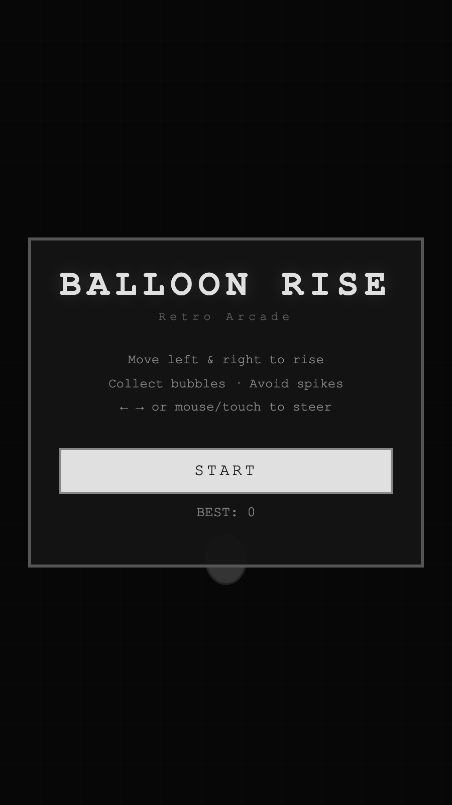
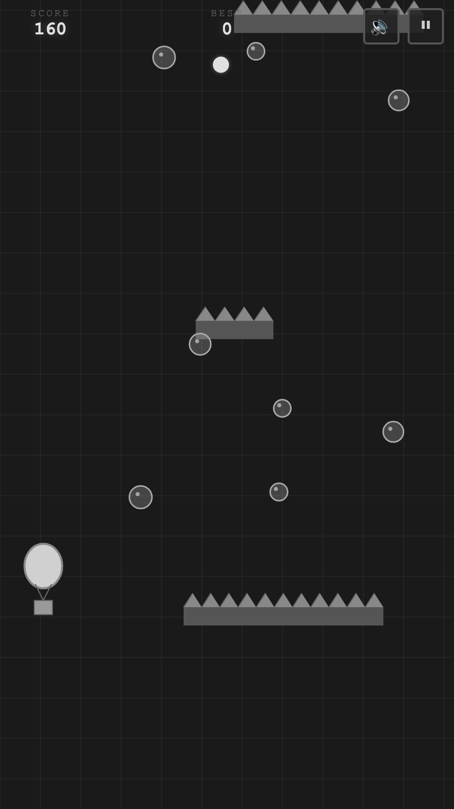
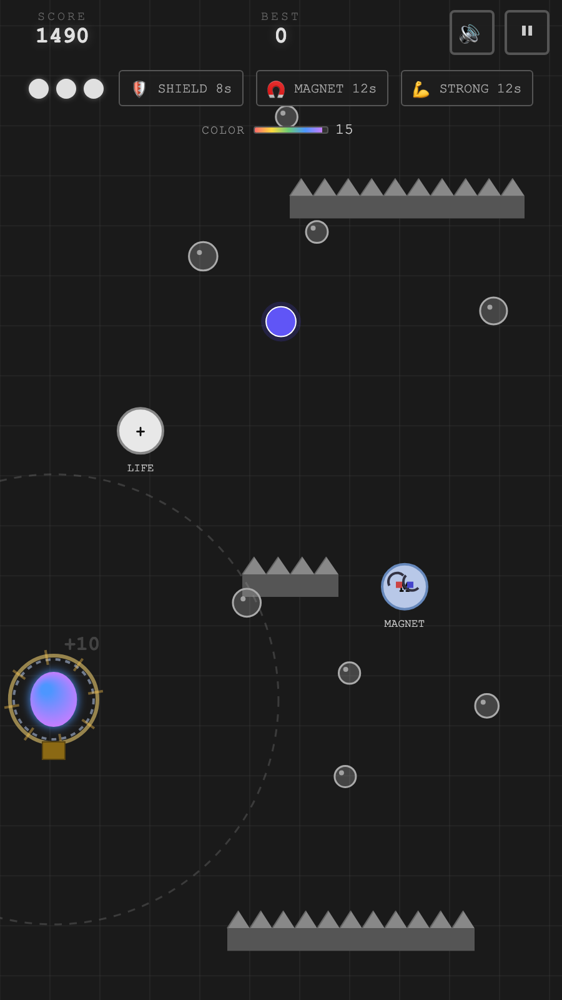
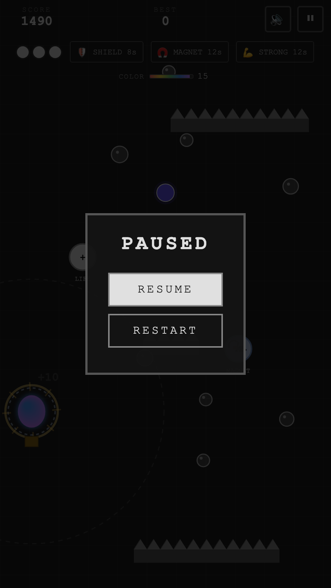
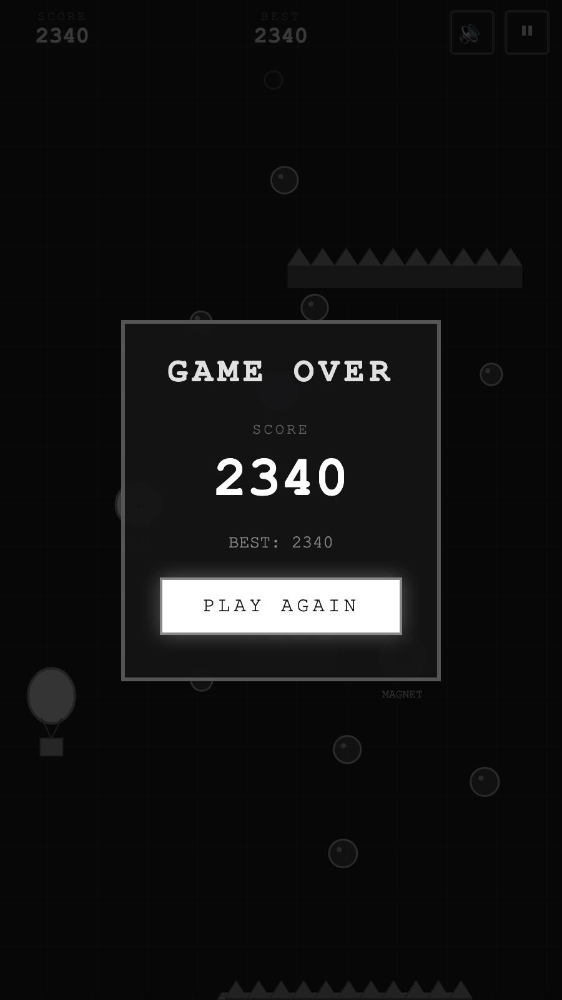

<div align="center">


# Balloon Rise

**A retro, monochrome arcade climber — steer a hot-air balloon up an endless shaft of spikes.**

Vanilla HTML + CSS + JavaScript on a single `<canvas>`. No frameworks, no build step, no assets to load.
Packaged for Android with [Capacitor](https://capacitorjs.com/).

</div>

---

## Screenshots

| Start | In flight |
| :---: | :---: |
|  |  |

| Power-ups & colour mode | Paused |
| :---: | :---: |
|  |  |

<div align="center">

</div>

---

## Gameplay

The world scrolls down, so the balloon is always climbing. Rows of spiked platforms drop in from
the top with a passage somewhere between them — find the gap, thread it, keep going. One touch of a
spike ends the run (unless something is protecting you).

The whole game is deliberately greyscale. The **only** colour on screen is your balloon, and only
while colour mode is running.

| | |
| --- | --- |
| **Bubble** | `+10` points. Spawns in waves of 3–6 every 2.8 s. |
| **Special ball** | `+100` points and 15 s of **colour mode** (your balloon turns full-colour). Every 30 s. |
| **Spiked platform** | Instant death. Rows get closer together and scroll faster as the run goes on. |
| **Lives** | Start with **1**. Extra lives cap at 5. |
| **Score** | Best score is kept in `localStorage`. |

### Power-ups

One power-up drops every 20 s, cycling through the four types in order:

| Icon | Power-up | Duration | Effect |
| :---: | --- | :---: | --- |
| 🧲 | **Magnet** | 12 s | Pulls bubbles within 180 px straight into you (specials too, at shorter range). |
| 🛡 | **Shield** | 8 s | Absorbs one spike hit, then shatters. |
| 💪 | **Stronghold** | 12 s | Smash straight through spiked platforms instead of dying. |
| ➕ | **Life** | — | `+1` life, up to 5. |

### Difficulty

Difficulty ramps linearly over the first **120 seconds**:

- scroll speed `120 → 320` px/s
- row spacing `280 → 140` px

After two minutes it holds at maximum — the run is only limited by your reflexes.

### Controls

| Input | Action |
| --- | --- |
| `←` `→` | Steer left / right (accelerating, with friction) |
| Mouse move | Balloon eases toward the cursor |
| Touch / drag | Balloon eases toward your finger |
| `Esc` / `P` | Pause & resume |
| 🔊 / ⏸ buttons | Mute, pause |

---

## Run it locally

No dependencies needed to just play — it's three static files:

```bash
python3 -m http.server 8123
```

Then open <http://localhost:8123>. Opening `index.html` directly with `file://` works too.

---

## Project layout

```
.
├── index.html              # markup: canvas, HUD, overlays
├── style.css               # retro monochrome theme
├── game.js                 # the entire game (~1300 lines, no dependencies)
├── hot-air-balloon.png     # source artwork for the app icon
├── capacitor.config.json   # Capacitor app id / name / webDir
├── www/                    # build output — copy of the three source files
├── android/                # generated Capacitor Android project
└── docs/                   # logo + screenshots used by this README
```

`game.js` is plain ES2020 organised into small classes:

| Class | Responsibility |
| --- | --- |
| `Game` | State machine (`start` / `playing` / `paused` / `gameover`), fixed-step loop, screen shake |
| `Balloon` | Player movement, power-up timers, rendering |
| `WorldSpawner` | Generates platform rows, bubble waves, power-ups, special balls |
| `CollisionManager` | Circle/circle and circle/spike tests |
| `UIManager` | All DOM reads & writes (HUD, overlays, timers) |
| `AudioManager` | Web Audio square/triangle/saw blips — no sound files |
| `Particle`, `ScorePopup` | Visual effects |

---

## Android build

The Android project is Capacitor-generated and committed to the repo.

```bash
npm install
npm run cap:android
```

| Script | What it does |
| --- | --- |
| `npm run build` | Copies `index.html`, `style.css`, `game.js` into `www/` |
| `npm run cap:sync` | Build, then `npx cap sync` into `android/` |
| `npm run cap:android` | Sync, then open the project in Android Studio |

> `www/` is the Capacitor `webDir`. Edits to the root source files only reach the app after
> `npm run build` (or `cap:sync`) — don't edit `www/` by hand.

To produce a debug APK without Android Studio:

```bash
npm run cap:sync && cd android && ./gradlew assembleDebug
```

The output lands at `android/app/build/outputs/apk/debug/Balloon-Rise-debug.apk`.

| | |
| --- | --- |
| App name | Balloon Rise |
| Application ID | `com.yourname.balloonrise` |
| Version | 1.0 (versionCode 1) |
| min / target SDK | 23 / 35 |
| Capacitor | 8.x (`@capacitor/core`, `@capacitor/android`) |

---

## Notes

- No external assets at runtime — every sprite is drawn with canvas primitives and every sound is
  synthesised with the Web Audio API, so the whole game is three files and a few hundred KB.
- `hot-air-balloon.png` (512×512) is the source image behind the Android launcher icon and splash.
- High scores are per-device, stored under the `balloon_high_score` key in `localStorage`.
